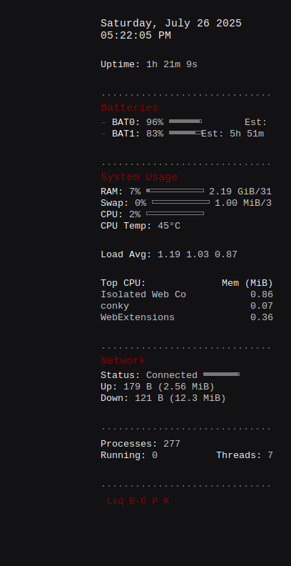

# minmal-dark-red-conky

A clean, minimalistic, and functional Conky configuration designed to display essential system information directly on your Linux desktop. This setup focuses on readability and a subtle aesthetic, providing key metrics at a glance.

## Features

This Conky configuration provides real-time monitoring for:

* **Date & Time:** Current day, date, and precise time.
* **System Uptime:** How long your system has been running.
* **Battery Status:**
    * Percentage for BAT0 and BAT1 (if available).
    * Charging (`+`), Discharging (`-`), or Full indicator.
    * Estimated time remaining (when charging or discharging).
    * Low battery alert (below 15% for BAT0).
* **Resource Usage:**
    * RAM (used percentage and actual values).
    * Swap (used percentage and actual values).
    * CPU (overall percentage).
    * CPU Temperature.
    * Disk Usage for Root (`/`) and Home (`/home`, if a separate partition).
    * System Load Averages (1, 5, and 15 minutes).
* **Top Processes:**
    * Top 3 CPU-consuming processes with their memory usage.
* **Network Activity:**
    * Detects common wireless (`wlan0`) or wired (`eth0`) interfaces.
    * Displays connection status, upload speed/total, and download speed/total.
    * Provides a simple status if no common interface is found.
* **Process Overview:** Total running processes and threads.

## Screenshot



## Installation Guide

Follow these steps to get Conky running with this configuration on your Linux system.

### Prerequisites

* **Conky:** Ensure Conky is installed on your system. You can typically install it via your distribution's package manager:
    * `sudo apt install conky-all` (Debian/Ubuntu/Mint)
    * `sudo dnf install conky` (Fedora)
    * `sudo pacman -S conky` (Arch Linux)

### Setup Steps

1.  **Download the `conky.conf` file:**
    You can either copy the code directly from this README or download the `conky.conf` file from this repository.

2.  **Place the `conky.conf` file:**
    Conky configuration files are usually stored in your user's configuration directory.
    * Create the `conky` directory if it doesn't exist:
        ```bash
        mkdir -p ~/.config/conky
        ```
    * Copy the `conky.conf` file into this directory:
        ```bash
        cp /path/to/downloaded/conky.conf ~/.config/conky/
        ```
        (Replace `/path/to/downloaded/conky.conf` with the actual location where you saved the file.)

3.  **Run Conky:**
    Open your terminal and execute:
    ```bash
    conky -c ~/.config/conky/conky.conf &
    ```
    The `&` puts Conky into the background, so your terminal remains usable. Your Conky should now appear on your desktop.

4.  **Autostart Conky (Optional but Recommended):**
    To have Conky start automatically every time you log in, you'll need to configure your desktop environment:
    * **GNOME/KDE/XFCE/LXDE (and others using XDG Autostart):**
        * The simplest way is often through your desktop environment's "Startup Applications" or "Autostart" settings. Search for it in your system's application menu.
        * Add a new entry with the command: `conky -c ~/.config/conky/conky.conf` (without the `&`).
    * **Manual `.desktop` file (Universal for XDG compliant DEs):**
        * Create a file named `conky.desktop` in `~/.config/autostart/`:
            ```bash
            nano ~/.config/autostart/conky.desktop
            ```
        * Paste the following content into the file and save:
            ```ini
            [Desktop Entry]
            Type=Application
            Exec=conky -c /home/YOUR_USERNAME/.config/conky/conky.conf
            Hidden=false
            NoDisplay=false
            X-GNOME-Autostart-enabled=true
            Name[en_US]=Conky
            Comment[en_US]=System Monitor
            ```
            **Important:** Replace `YOUR_USERNAME` with your actual Linux username.

## Customization Notes

This configuration is designed to be adaptable. Here are a few common things you might want to adjust:

* **Network Interface:**
    The network section currently tries to detect `wlan0` (Wi-Fi) and `eth0` (Ethernet). If your network interface has a different name (e.g., `enp0s3`, `wlp2s0`, `wlx...`), Conky might show "Disconnected."
    * To find your interface name, open a terminal and type: `ip a`
    * Look for the name next to your active connection (it usually has an IP address).
    * Edit `conky.conf` and replace `wlan0` or `eth0` with your actual interface name in the "Network" section.

* **CPU Temperature:**
    The configuration uses `${acpitemp}` for CPU temperature, which works for many systems. If it shows 0°C or is blank, your system might use a different sensor path.
    * You might need to use `${hwmon temp N}` where `N` is the sensor number. You can find available sensors by listing files in `/sys/class/hwmon/`.

* **Batteries:**
    The configuration checks for `BAT0` and `BAT1`. If your system only has one battery or names them differently, the respective sections will simply not appear. This is normal behavior.

* **Colors and Fonts:**
    You can easily change the colors and fonts directly within the `conky.config` section at the top of the `conky.conf` file to match your desktop theme.

## License

This Conky configuration is licensed under the **GNU General Public License v3.0 (GPLv3)**. See the `LICENSE` file in this repository for full details.

## Acknowledgements (Optional)

This Conky configuration was developed with collaborative assistance from Google's Gemini.
